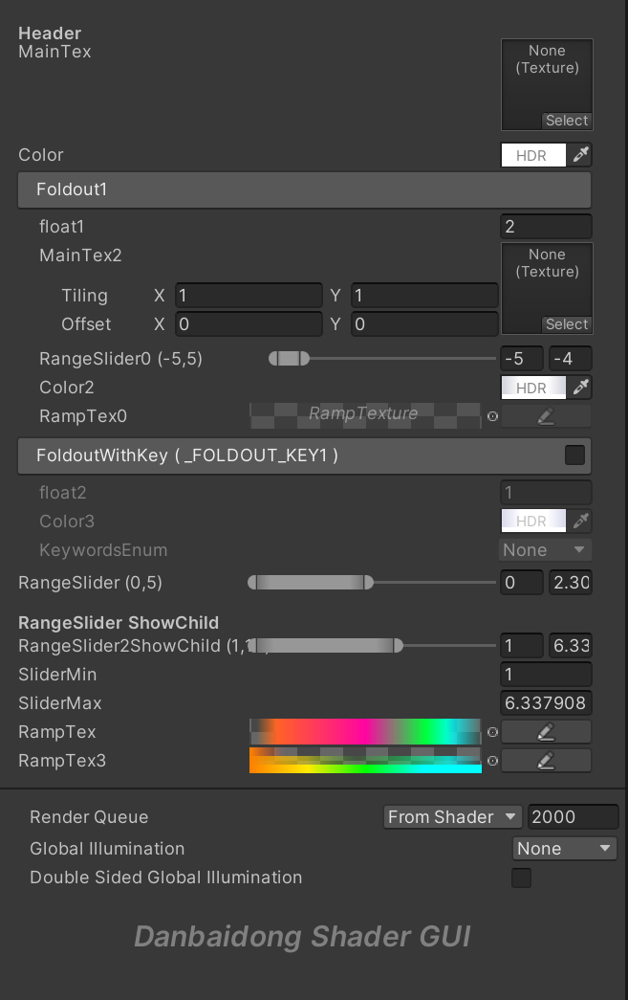
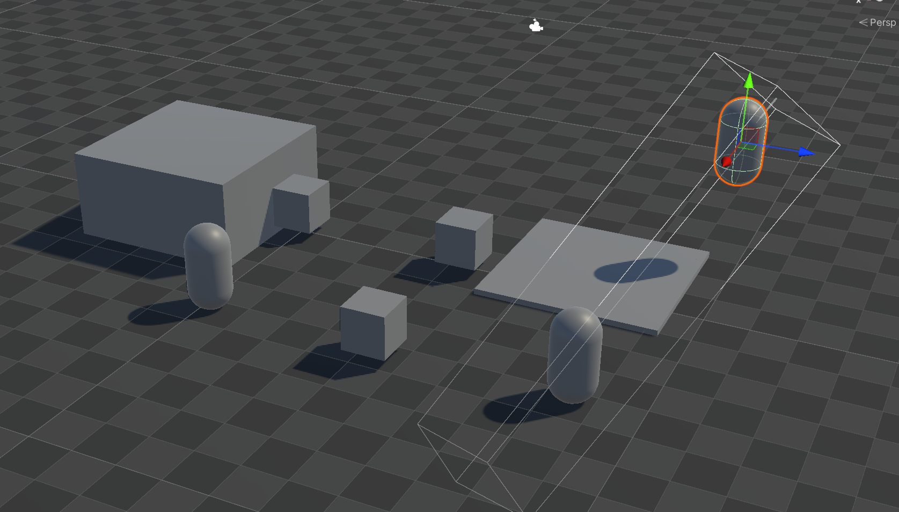
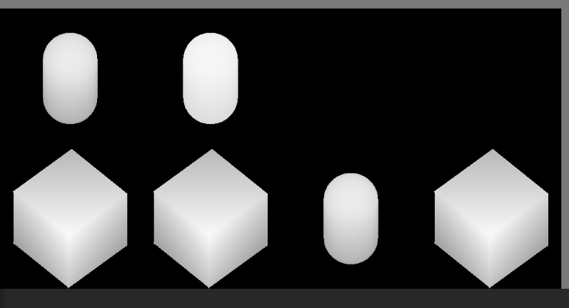

  
   # **Danbaidong Render Pipeline**

   ## Announcement
   Just add something I need.

   `DanbaidongRP` based on Universal RP 14.0.8, Unity 2022.3. It's more convenient for PBR/NPR Toon Rendering. In the future, I will move in some things according to my own needs.

Follow me~

https://space.bilibili.com/39694821

https://www.zhihu.com/people/danbaidong1111

Currently completed modules
- PBR Toon Shader
- Danbaidong Shader GUI
- PerObjectShadow
- Inserted GBuffer Passes
- Toon Bloom
- Anime Toonmapping

Roadmap
- Cluster Deferred lighting( It seems that unity has already implemented it in forward+ )
- Atmosphere Fog
- PCSS/PCF Soft Shadows
- Gradient Shadows
- Transparent Shadows
- High Quality SSR
- High Quality SSGI
- Idol Live アイドル!!!!!

# Usage
1. New 3D Core project(not URP or others) from Unity version: 2022.3.x. (3.7f1 is recommend)
2. Add following packages by UPM (Window -> Package Manager)
- `https://github.com/danbaidong1111/DanbaidongRPCore.git#v14.0.8-beta.1`
- `https://github.com/danbaidong1111/DanbaidongRP.git#v14.0.8-beta.1`
- `https://github.com/danbaidong1111/SmoothNormal.git#v1.0.1`
  
  (Optional: You can get smoothNormal for outline just modify model file name by The suffix “_SN”)
3. Create -> Rendering -> URP Asset (with Universal Renderer). I have changed the default configuration for you.
4. Project Settings -> Graphics -> Scriptable Render Pipeline Settings. Set the asset we just created.

# Toon Rendering
Usage: Sorry, I can only tell you that Renderer Data "InsertedGbuffer Passes" settings.

See https://miusjun13qu.feishu.cn/docx/FklhdkY5YoUKDaxBZ1QcFFLqnQe for more information.

# Danbaidong Shader GUI
Usage: Add `CustomEditor "UnityEditor.DanbaidongGUI.DanbaidongGUI"` in your shader.

# PerObjectShadow
Usage: 
1. Add renderer freatures: ScreenSpaceShadows and PerObjectShadowFeature. 
2. Add PerObjectShadowProjector Script at your Mesh Object.

